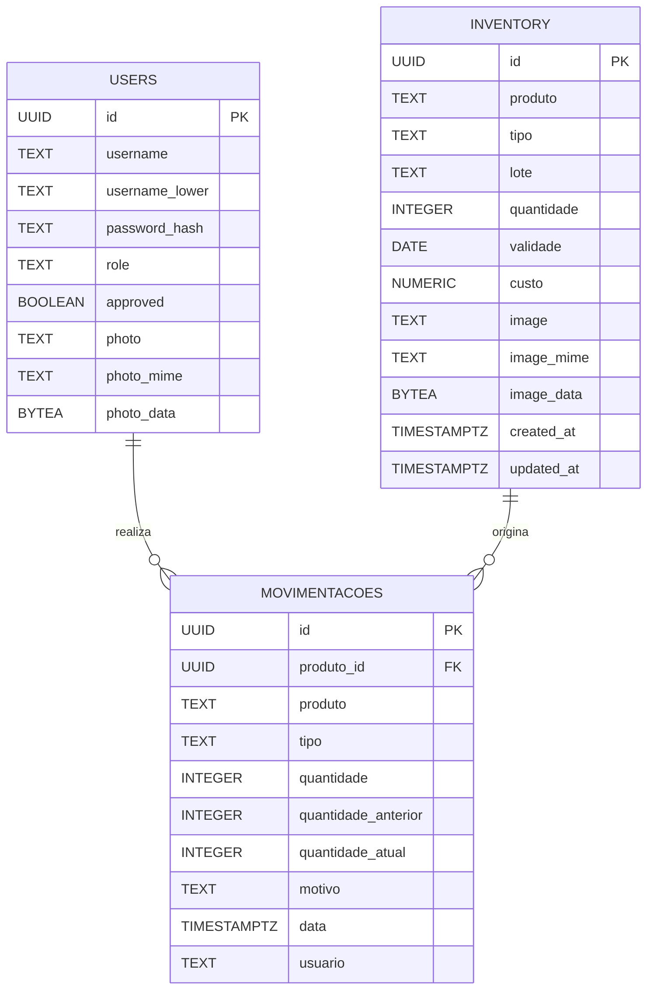

# Modelo Conceitual de Dados

Este documento apresenta o Modelo Conceitual de Dados do sistema de controle de estoque. O objetivo é descrever as principais entidades, atributos e relacionamentos identificados a partir dos requisitos funcionais da aplicação web existente.

## Diagrama Entidade-Relacionamento (DER)

## Entidades

- **Users**: representa os usuários autenticados do sistema. Os atributos contemplam identificação (`id`), credenciais (`username`, `password_hash`), papéis (`role`), status de aprovação (`approved`) e referência opcional à foto de perfil (`photo`, `photo_mime`, `photo_data`). O atributo `username_lower` é derivado para facilitar buscas case-insensitive.
- **Inventory**: corresponde ao catálogo de itens controlados no estoque. Inclui dados de identificação (`id`, `produto`, `tipo`, `lote`), controle quantitativo (`quantidade`, `custo`, `validade`) e recursos multimídia (`image`, `image_mime`, `image_data`, `created_at`, `updated_at`).
- **Movimentacoes**: registra o histórico das movimentações de estoque. Armazena o identificador do registro (`id`), referência ao item movimentado (`produto_id`), descrição textual (`produto`), classificação da movimentação (`tipo`), variação de quantidades, motivo, usuário responsável e carimbo temporal.

## Relacionamentos

- **Users 1:N Movimentacoes** – cada movimentação é executada por um único usuário autenticado, enquanto um usuário pode gerar diversas movimentações ao longo do tempo.
- **Inventory 1:N Movimentacoes** – cada movimentação está associada a um item específico do estoque, porém o histórico de um item pode conter várias movimentações (entradas, saídas, edições e exclusões).

As cardinalidades opcionais ("zero ou mais") refletem o fato de que movimentações podem manter o campo `produto_id` nulo quando o item correspondente é removido fisicamente do estoque, mantendo-se apenas a descrição textual para fins históricos.

